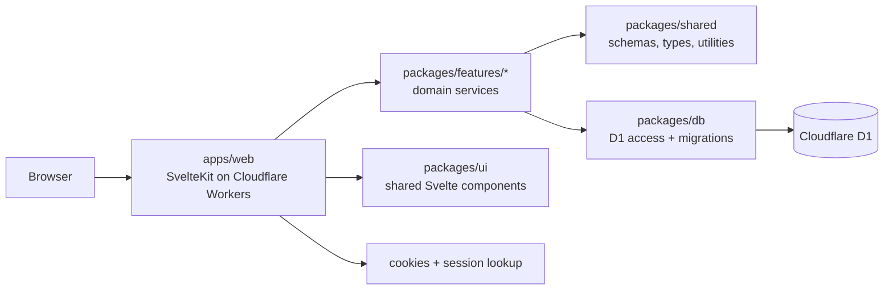
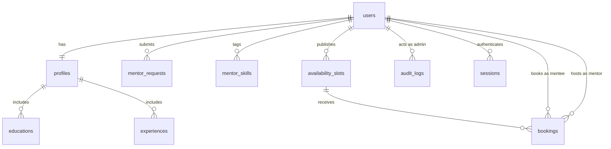
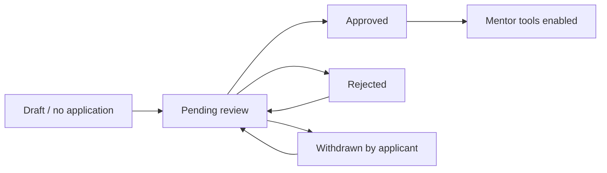
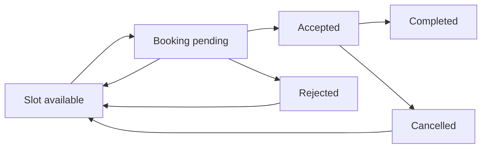

# Architecture

MentorMatch is organized as a single-deploy full-stack workspace. The active application is a SvelteKit Worker in `apps/web`, while database access, business rules, contracts, and UI building blocks are isolated into separate packages.

## System Overview



Only `apps/web` is deployed. Everything under `packages/*` is bundled into that Worker as internal dependencies.

## Core Product Flows

- guests can browse the homepage, sign up, and log in
- signed-in users can search mentors, manage bookings, edit their profile, log out, change their password, and delete their account
- new accounts are created as mentees first
- users who want to mentor submit an application on `/mentor-verification`
- the mentor application is launched from a full-width dialog so the review form is not constrained to a half-page column
- admin accounts review mentor applications on `/admin/review`
- admin accounts can also manage users, public profile details, mentor access, and upcoming slots from dedicated admin routes
- admin mutations are routed through a dedicated admin feature package so review, role changes, managed profile edits, and slot removals can share audit and permission rules
- admin list screens expose search, filter, sort, pagination, and consistent apply/clear controls so moderation does not depend on loading every record into one flat page
- admin-managed profile saves post the selected `userId` explicitly and the server revalidates that scope before updating any public profile records
- successful admin edits redirect back to the same managed `/profile?userId=...` route so the post-save page state stays attached to the edited user
- the profile `Skills` input stores comma-separated values and the UI renders them back as individual tags
- `Professional skills` and `Mentorship areas` are optional free-entry fields, and applicants can withdraw a pending request before admin review
- approved users gain mentor tools while still keeping mentee booking flows
- profile and application links are normalized to `https://...` before validation
- profile education and experience records can be saved with partial details, while completely blank cards are skipped
- availability defaults to the mentor's current browser time zone, but the mentor can switch to another IANA time zone before publishing
- mentors can create either a one-off slot or a recurring series using daily, weekday, weekly, biweekly, or monthly presets
- recurring slots are persisted as separate occurrences so a single middle session can be edited or deleted independently
- accepted sessions automatically become completed after their scheduled end time through a Cloudflare scheduled job, and mentors can manually complete them earlier when needed
- slots support two booking modes: preset mentor agenda or open topic chosen by the mentee
- booking rules prevent duplicate same-slot requests, overlapping active mentee requests, and multiple accepted bookings on a single slot
- booking mutations use database-backed constraints and batched writes so accept/cancel flows update request state and slot occupancy together
- booking and hosted-session cards use a denser metadata layout so filtering large lists stays readable on smaller screens
- availability is converted to UTC on submit and rendered back in each viewer's locale
- the shared app shell collapses navigation on small screens and keeps account actions, including logout, reachable in a mobile menu
- the mobile shell also preserves bottom spacing under the `Open navigation` control so content does not butt directly against the topbar

## Repository Structure

```text
MentorMatch/
├── apps/
│   └── web/
│       ├── src/routes/         # public pages, page.server files, explicit API handlers
│       ├── src/lib/server/     # Worker-only helpers for auth, db access, cookies, errors
│       ├── src/lib/            # app-local utilities, styles, navigation, assets
│       └── wrangler.jsonc      # Worker configuration and D1 binding
├── packages/
│   ├── db/                     # D1 client, SQL helpers, migrations
│   ├── features/               # auth, admin, mentors, availability, bookings, profile
│   ├── shared/                 # contracts, schemas, errors, shared types
│   ├── ui/                     # reusable Svelte components
│   └── config/                 # shared toolchain config
├── tests/
│   ├── integration/
│   ├── e2e/
│   └── fixtures/
└── .github/workflows/
```

## Deployment Model

The current deployment target is:

- one Worker script: `mentormatch`
- one D1 binding: `DB`
- one SvelteKit app build output under `apps/web/.svelte-kit/cloudflare`
- one wrapper Worker entrypoint at `worker-entry.ts` that handles both `fetch()` and scheduled cron invocations

The repository root exposes a deployable [wrangler.jsonc](./wrangler.jsonc).

The root upload path is:

1. `pnpm cf:upload`
2. or `npx wrangler versions upload`

Both commands run from the repository root, and Wrangler triggers `pnpm build` before uploading the Worker version. This keeps Cloudflare Workers Builds aligned with the monorepo root while still publishing the SvelteKit output from `apps/web`.

## Layer Responsibilities

### `apps/web`

This package owns:

- page rendering
- page loads and actions
- explicit HTTP APIs under `src/routes/api/*`
- thin route entrypoints that authenticate, parse request data, call command handlers or feature services, and map the result back to SvelteKit responses
- request-scoped auth/session wiring in [hooks.server.ts](./apps/web/src/hooks.server.ts)
- request-scoped request-id generation plus `x-request-id` response propagation in [hooks.server.ts](./apps/web/src/hooks.server.ts)
- structured Worker-side logging helpers in `src/lib/server/log.ts`
- Worker-facing config in [wrangler.jsonc](./apps/web/wrangler.jsonc)

It is the only package that should know about SvelteKit route structure and Worker deployment details.

Within `apps/web`, reusable route-side command handlers and form mappers live under `src/lib/server/*` so the biggest `+page.server.ts` files do not accumulate recurrence, profile parsing, or action orchestration logic directly.

### `packages/features/*`

Feature packages hold business logic by domain:

- `auth`
- `admin`
- `profile`
- `mentors`
- `availability`
- `bookings`

These packages own:

- validation orchestration
- domain rules
- service-level logic
- recurring availability expansion, UTC normalization, and other business rules that should be shared across form actions and API handlers
- admin review and moderation commands, including audit-backed user, mentor, and slot management
- unit tests close to the feature

### `packages/db`

The database package owns:

- the D1 client
- SQL execution helpers
- schema migrations
- persistence adapters used by feature packages

Route handlers and Svelte components should not embed direct SQL.

### `packages/shared`

This package contains framework-agnostic shared code:

- error types
- validation schemas
- shared types
- contracts and utility helpers

### `packages/ui`

This package contains reusable Svelte UI primitives used across the Worker app.

## Data Model

Core persistence lives in Cloudflare D1 and follows a small relational model:

- `users` is the identity root for account role, approval state, and session ownership.
- `profiles` stores public-facing profile fields in a one-to-one extension of `users`.
- `educations` and `experiences` are child records under a profile.
- `mentor_requests` stores mentor application submissions and review outcomes.
- `mentor_skills` stores public skill tags shown on mentor cards and profiles.
- `availability_slots` stores each bookable mentor occurrence as its own row.
- `bookings` stores mentee requests against one slot, including request lifecycle state.
- `audit_logs` stores admin-side moderation events, actor identifiers, request ids, and compact JSON metadata for reviewable writes.
- `sessions` stores active login sessions.



## Time And Recurrence Model

- Availability is captured as `local datetime + IANA time zone` in the UI, then converted to UTC before persistence.
- `availability_slots.start_time` is the canonical comparison field for sorting, overlap checks, and booking enforcement.
- Recurring publication is materialized into separate `availability_slots` rows up front, not stored as one RRULE-only record.
- Read-side UI can still group matching occurrences into a visible series, but write-side operations remain occurrence-scoped.
- `availability_slots.is_booked` is treated as a database-maintained read model derived from accepted bookings, while booking status remains the source of truth.
- admin moderation is audited as its own write stream so privileged actions can be reconstructed without relying on ad hoc request logs alone.

Why this matters:

- UTC storage removes ambiguous cross-time-zone comparisons at booking time.
- Materialized occurrences let mentors edit or delete one middle session without introducing exception tables.
- Booking state is naturally per occurrence, which fits accepted, cancelled, and completed flows better than mutating a single recurrence rule.

## Request Flows

### Public Page

```text
Browser
  -> /
  -> /login
  -> /signup
```

These pages are available without a session.

### Authenticated Page

```text
Browser
  -> apps/web/src/routes/+layout.server.ts
    -> session lookup via hooks.server.ts
      -> protected page load/action
        -> feature module
          -> db
```

Protected routes redirect unauthenticated users to `/login`.

### API Request

```text
Browser or client
  -> apps/web/src/routes/api/*
    -> feature module
      -> packages/db
        -> D1
```

## State Flows

### Mentor Application



### Booking Lifecycle



Notes:

- Rejected and cancelled requests do not permanently retire a slot.
- Accepted bookings mark the slot as booked through DB-enforced write rules; completed sessions are produced automatically after the scheduled end time or manually by the mentor earlier.

## Runtime Bindings

The Worker currently expects:

- `DB` for D1
- `ASSETS` for static assets
- `AUTH_SECRET` for session/auth operations
- a cron trigger that invokes the shared `scheduled()` handler every 15 minutes in UTC

Operationally, the app also relies on:

- request ids generated in `hooks.server.ts` and returned as `x-request-id`
- structured JSON logs for admin actions and scheduled booking completion
- audit rows in D1 for privileged admin mutations that change mentor approval, public profile records, or slot inventory

If `DB` or `AUTH_SECRET` are missing, public pages can still render basic content, but authenticated flows and data-backed operations will be limited.

## Testing Strategy

The current workspace uses:

- `pnpm lint`
- `pnpm check`
- `pnpm test:unit`
- `pnpm test:e2e`
- `pnpm build`

Coverage is split so feature logic can be tested separately from browser-visible flows.
The current test suite covers signup, login, logout, settings, mentor application review and withdrawal, admin-managed profile scope, audit-backed admin commands, profile link normalization, recurring availability creation, booking guardrails, and the mentor/mentee routing rules that connect them.

## CI/CD

GitHub Actions provide:

- linting
- Svelte and TypeScript checks
- unit tests
- Playwright end-to-end tests

Deployment is handled by Cloudflare Workers Builds, which calls the root upload script and uses the bindings configured for the `mentormatch` Worker.
